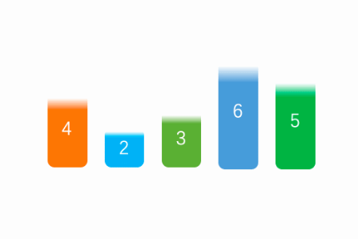
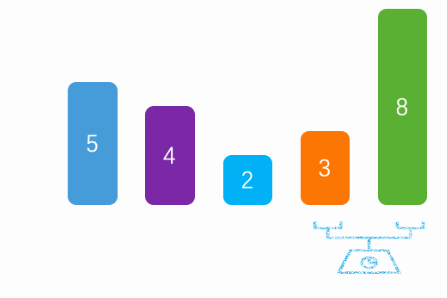

# 排序算法

## 简单排序
一般来说，插入排序都采用in-place在数组上实现。具体算法描述如下：
1. 从第一个元素开始，该元素可以认为已经被排序
2. 取出下一个元素，在已经排序的元素序列中从后向前扫描
3. 如果该元素（已排序）大于新元素，将该元素移到下一位置
4. 重复步骤3，直到找到已排序的元素小于或者等于新元素的位置
5. 将新元素插入到该位置后
6. 重复步骤2~5
整两个for循环.
   第一个for循环i，遍历数组一遍。{
   第二个for循环j{
   i=j;
   i会和当前i之后的数据一一比对，交换大小，确保当前的i是最小值
    } }
## 选择排序

a、将第一个值看成最小值  

b、然后和后续的比较找出最小值和下标  

c、交换本次遍历的起始值和最小值  

d、说明：每次遍历的时候，将前面找出的最小值，看成一个有序的列表，后面的看成无序的列表，然后每次遍历无序列表找出最小值。  
 
e、代码实现  

## 插入排序

a、默认从第二个数据开始比较。  

b、如果第二个数据比第一个小，则交换。然后在用第三个数据比较，如果比前面小，则插入（狡猾）。否则，退出循环  

c、说明：默认将第一数据看成有序列表，后面无序的列表循环每一个数据，如果比前面的数据小则插入（交换）。否则退出。  

d、代码实现  
##冒泡排序

a、冒泡排序，是通过每一次遍历获取最大/最小值  

b、将最大值/最小值放在尾部/头部  

c、然后除开最大值/最小值，剩下的数据在进行遍历获取最大/最小值  

d、代码实现  